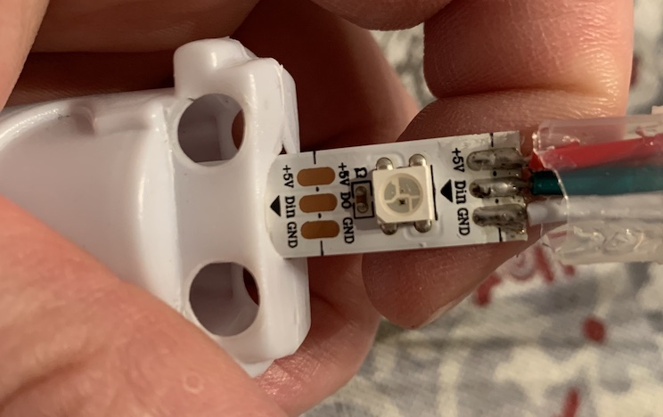
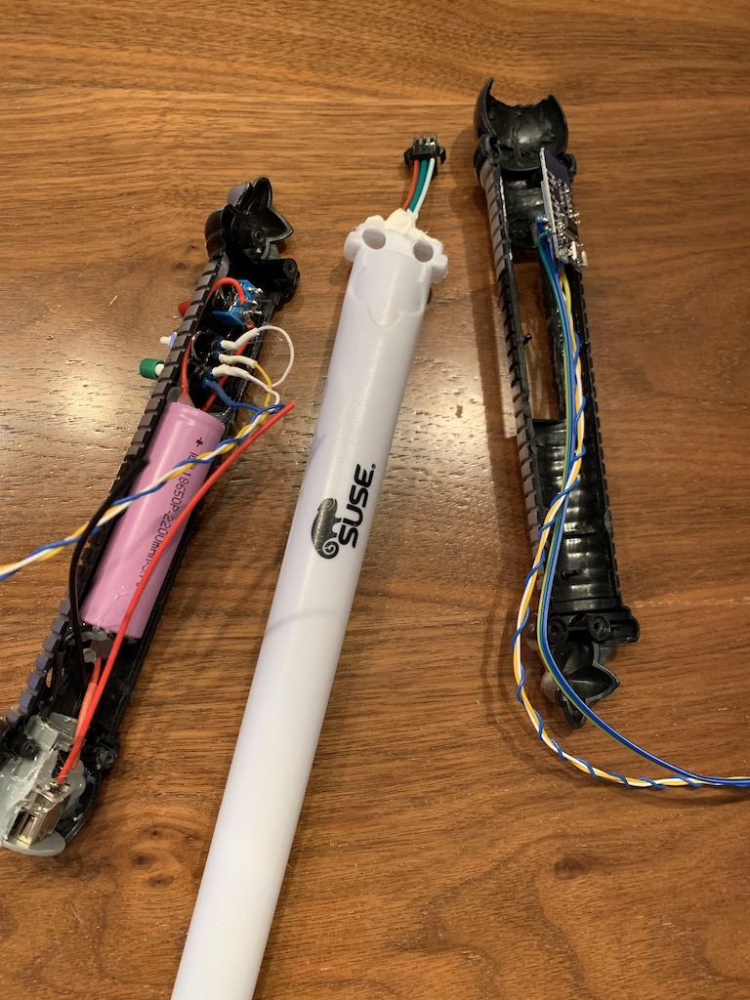
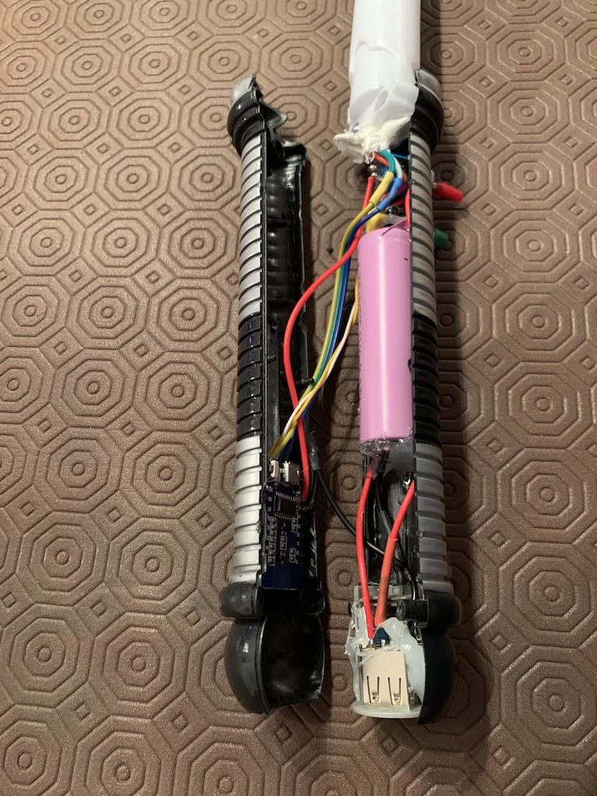
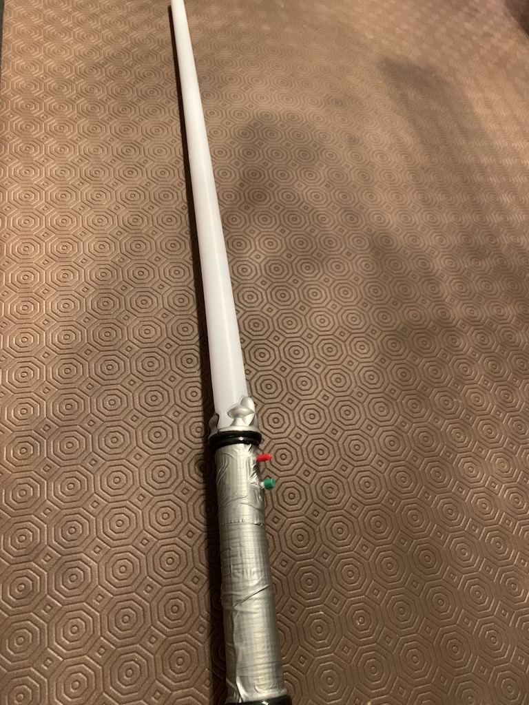

# Up-cycled lightsaber with WS21812b and ESP8266

## Pieces used

Hardware

- A simple lightsaber that I got as a present at an SAP TechEd fair from Suse
- An USB charger that I got at another SAP TechEd fair from the [openSAP](https://open.sap.com/courses) team
- A [WS2812B LED strip for 5V](https://www.amazon.com/s?k=ws2812b+led+strip+5v)
- A cool looking red switch to turn on the lightsaber
- A less cool looking green button to switch between the lightsaber modes
- An [ESP8266 D1 Mini](https://www.amazon.com/s?k=esp8266+d1+mini)

Software

- The WS2812FX Arduino library

And most importantly: a lot of patience to make all the pieces fit together :-)

## Circuit diagram

No time so far to write it down. Will work on it if somebody is interested in knowing how I've connected all the pieces.

## Inserting WS2812B LED strip into lightsaber plastic tube

## Configuring the pieces

## Ready to connect

## Done
